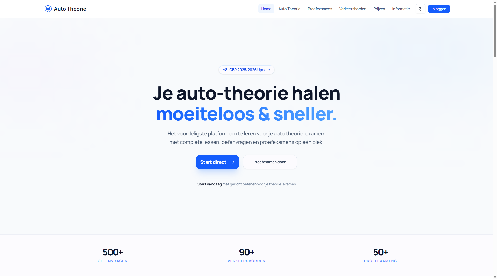

# Auto Theorie - Oefenplatform voor het Theorie-examen

  
  
  

**Oefen gratis met voorbeeldlessen en stap over naar volledige toegang wanneer je er klaar voor bent.**

  

## Over Auto Theorie

*Auto Theorie* is een modern, interactief leerplatform waarmee je je optimaal kunt voorbereiden op je theorie-examen voor de auto. Met realistische oefenvragen, proefexamens, en een uitgebreide verkeersbordenbibliotheek is dit hét platform voor iedereen die wil slagen.

## Inhoudsopgave

- [Functionaliteiten](#functionaliteiten)  
- [Technologieën](#technologieën)  
- [Paginastructuur](#paginastructuur)   
- [Bijdragen](#bijdragen)  
- [Licentie](#licentie)  
- [Versie](#versie)  
- [FAQ](#faq)  
- [Contact](#contact)

## Functionaliteiten

-  **Oefenmodules** — Realistische vragen per categorie, zoals voorrang, verkeersborden, etc.  
-  **Proefexamens** — Ervaar hoe het echte theorie-examen voelt.  
-  **Verkeersborden** — Leer alle Nederlandse verkeersborden met visuele ondersteuning.
-  **Voortgangsmeting** — Houd je prestaties en groei bij.  
-  **Mobile-friendly** — Oefen altijd en overal, op mobiel, tablet of desktop.  

## Technologieën

  
  
  
  
  
  
  

## Paginastructuur

- **Home** — Introductie tot het platform met duidelijke call-to-actions.
- **Oefenen** — Selecteer categorieën en oefen per onderwerp.
- **Proefexamens** — Neem volledige proefexamens af zoals bij het CBR.
- **Verkeersborden** — Alle verkeersborden overzichtelijk met uitleg.

## Bijdragen

Bijdragen zijn van harte welkom! Volg deze stappen om bij te dragen:

1. Fork deze repository  
2. Maak een feature branch (`git checkout -b feature/naam`)  
3. Commit je wijzigingen met duidelijke berichten  
4. Dien een Pull Request in

> *Samen bouwen we aan een gratis en toegankelijk theorieplatform voor iedereen!*

## Licentie

Dit project valt onder de [MIT Licentie](LICENSE). Bekijk het LICENSE-bestand voor de volledige tekst.

## Versie

**Huidige versie:** `v1.0`

## FAQ

Kan ik gratis starten?

Ja. Je kunt direct starten met een selectie lessen en voorbeeldvragen. Volledige toegang is beschikbaar via een pakket.

Zijn de vragen gelijk aan het echte CBR-examen?

De vragen zijn gebaseerd op het officiële CBR-vragentype en zijn samengesteld met dezelfde logica, maar zijn niet exact identiek.

Kan ik mijn voortgang bijhouden?

Ja, na betaling wordt je voortgang opgeslagen via je account.

## Contact

Voor vragen, feedback of samenwerking:  

Dank je wel voor het gebruiken van *Auto Theorie* — en veel succes met je theorie-examen!